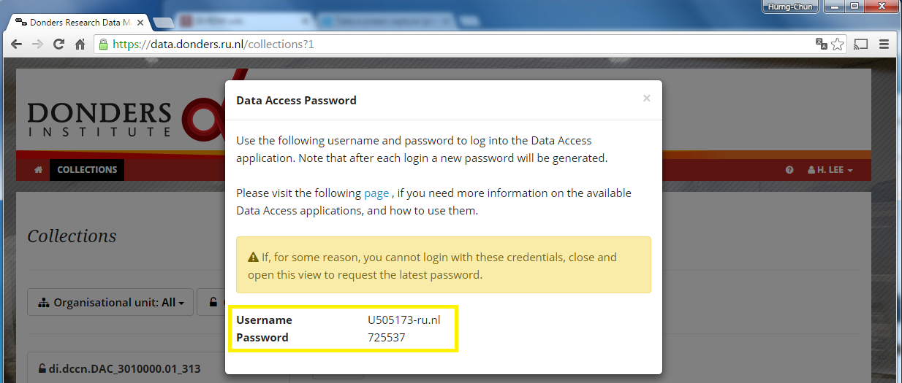

  

## Retrieve the Webdav user name and password

After [logging to the web portal](user_login.md), you should:

1. Click on your display name at the top-right corner of the web portal to toggle a pull-down manual, and select the item `Data Access Password`:

  

2. Informaton of a valid data-access account (the _username_ and the _one-time password_) is displayed on the overlay page. You may copy the information and use it in the [data-access client](webdav.md).

  Warning: for security you should close the overlay page as soon as you have copied the account information.

  

3. One can always retrieve again the account information (with a new _one-time password_ if the previous one has been used) by repeating Step 1.
