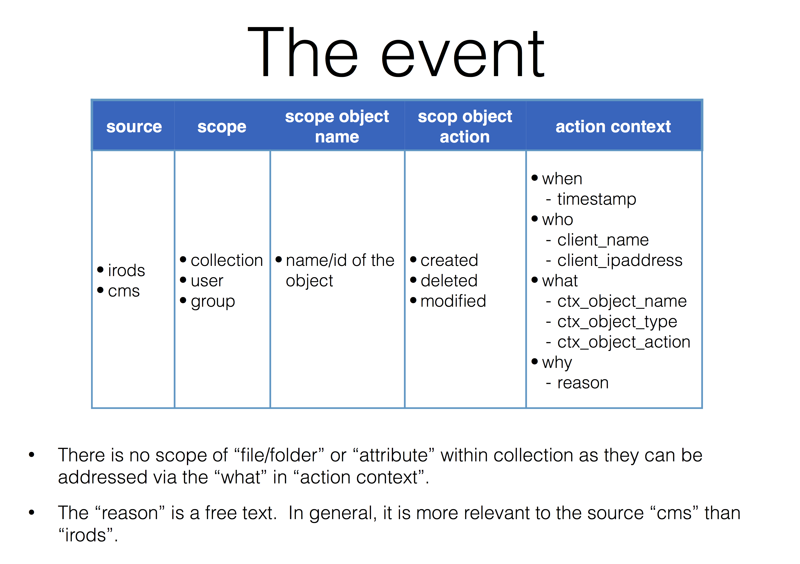

# System design and architecture

## Authentication

The RDM system makes use of SURFConext (and eventually the EduGAIN) service for user authentication.  It implies that users already have valid account from collaborating institutues world-wide will have immediate access to the system.

### Temporary user credentail for data access

While the CMS interface makes use of SURFConext for authentication, the data access interface RDM has difficulity to integrate SURFConext due to technical limitation.  A workaround in RDM is to employ a so-called [event-based one-time password mechanism](https://en.wikipedia.org/wiki/HMAC-based_One-time_Password_Algorithm).

Before accessing the data in the repository, user firstly signs in to the CMS via SURFConext (and therefore the user is authenticated by IdP).  From the CMS, the user retrieves a temporary user credential for data access. The user credential consists of a static account name (i.e. it is always the same for the same user) and a fresh one-time password.  The crendential can only be utilised once for the authentication process; however, on the server-side of the data access interface, the credential is cached for certain time span, allowing stateless data transfer protocols (e.g. WebDAV) to operate smoothly.

## Data management

The RDM data management system is based on [iRODS](http://irods.org).  iRODS rules are implemented to support the data management workflows specified in [the protocols]().

### Authorisation

In the RDM system, authorisation is goverened by user roles that are defined in two aspects. In one aspect, there are three user roles associated with each individual RDM collection. The three roles are `manager`, `contributor` and `viewer`.  In the other aspect, there are roles closely related to user's function in an organisational unit, and they are `ou_user` and `ou_admin` roles.  Authorisation policy of those roles are defined in [the RDM protocols]().

The iRODS user group is utilised to make technical implementation of the user roles.  Technically speaking, granting (revoking) a user with (from) an user role is done by adding (removing) the user to (from) a particular iRODS user group.  Those actions are triggered automatically at relevant policy-enforcement points in iRODS.  For example, when a collection's viewer/manager/contributor attributes are modified.

### Collection namespace

In iRODS, the following directory-tree structure is defined to reflect the hierachy of __a `Collection` belonging to an `Organisational Unit` of an `Organisation` in the RDM iRODS `Zone`__:

```bash
/Zone
  |- /Organisation_1
  |   |- /Organisational_Unit_A
  |   |   |- RDM_Collection_I
  |   |   |- RDM_Collection_II
  |   |   
  |   |- /Organisational_Unit_B
  |   
  |- /Organisation_2
  |- ...
```

Thus, the collection namespace of `RDM_Collection_I` in iRODS is given as `/Zone/Organisation_1/Organisational_Unit_A/RDM_Collection_I`.  Within the collection namespace, users (with `contributor` or `manager` role) have freedom to organise data belonging to the collection.

### Collection identifiers

An RDM collection has at-least one identifier.  The obviouse one is the internal identifier, which is given very similar to the collection namespace discussed before. For example, the collection with namespace `/Zone/Organisation_1/Organisational_Unit_A/RDM_Collection_I` also acquires an internal identifier `Organisation_1.Organisational_Unit_A.RDM_Collection I`.

When a collection gets closed (see _collection state and versioning_ below), a frozen copy of it is created.  At the same time, the frozen copy also acquires a global identifier from the [European Persistent Identifier Consortium (ePIC)](http://www.pidconsortium.eu/).

### Collection state and versioning

Initially, a collection is in state `open`.  When a read-only snaphsot is needed, e.g. for publishing a collection, one triggers the state transition from `open` to `tobeclosed` then to `closed`.  Possible state transitions are illustrated in the picture below:


At the state of `tobeclosed`, the collection is set to read-only.  When the state is moved to state `closed`, the collection is cloned into a frozen copy (or a _snapshot_).  The collection snapshot is strictly read-only, and has data content and collection attributes identical to its original collection (or the _head_).  The figure below shows the state evolvement of a collection and the creation of two snapshots along the time line.


Every collection snapshot acquires a version number.  The numver is reflected on the snapshot's collection namespace as a suffrix, e.g. __:v1__, __:v2__, etc.

Every collection snapshot also acquires an attribute for a global persistent identifier, for example `identifierEPIC`.  However, the same identifier is shared amongst the snapshots originated from the same head collection.

### Attributes and metadata

In the RDM system, attributes are used to describe a user or a collection.  Those attributes are stored in key-value pairs in the iCAT database, along with the user and collection in question.  The defined user attributes are found [here](user_attributes.md); and [this page](collection_attributes.md) lists all collection attributes. 

Metadata only becomes relevant when there is an recipient involved. Given a metadata schema (e.g. DataCite), attributes are tramsformed into the metadata fields defined by the schema.

### iRODS storage resources

With the target of maintaining two copies of data in the RDM system, we virtually distinguish the iRODS storage resources into the so-called _online_ and _nearline_ resources.  Generally speaking, the _online_ resource is the location where the first copy of data is created (e.g. when a file is just uploaded to the system).  Data arrived at the _online_ resource is replicated in the background do the _nearline_ resource.  Both _nearline_ and _online_ resources are used to serve data download.

Furthermore, each `Organisation Unit` is associated to a _online_ resource to host the collection data with namespace under the same `Organisational Unit`.  Qotum is then applied to the underlying data storage attached to the _online_ resource.  Thus, each `Organisational Unit` is limited to a physical storage boundary in the RDM system.

An example snapshot of the iRODS resource tree:

```bash
resc_dcc:random
└── vault_dcc_1
resc_dccn:random
└── vault_dccn_1
resc_dcn_m:random
└── vault_dcn_m_1
resc_dcn_s:random
└── vault_dcn_s_1
resc_nl:random
└── rdmRes2Test
```

In the example, resource `resc_nl` is the _nearline_ resource; while `resc_dccn`, `resc_dcc`, `resc_dcn_s` and `resc_dcn_m` are _online_ resources, each for a centre/organisational unit of the Donders Institute.

Moreover, both _online_ and _nearline_ resources are defined as a [composable resource](https://docs.irods.org/4.1.7/manual/architecture/#composable-resources) to be able to integrate distributed/heterogeneous data storages.

## Data storage

The physical storage for data is relatively independent to the RDM application, thanks to the abstraction layer provided by iRODS.  Nevertheless, we do require the underlying data storage to provid the following features:

* mountable filesystem as it is required by the _filesystem_ iRODS resource type
* proactive data integrity check to prevent data corruption
* efficient data de-duplication mechanism to save storage space for eventual duplication of same scientific data in the repository
* quota on filesystem directory

## Auditing

WARNING: the design of auditing described below is a proposal and still to be discussed.

### Architecture

The figure below shows the auditing architecture.  In this picture, both CMS and iRODS ingest audit information into an [elastic search engine](https://www.elastic.co/), upon certain user actions.  The search engine is then provided as the data source for reporting and generating digest emails.  Interaction with the elastic search engine is based on the RESTful APIs.


### iRODS audit event

In several policy-enforcement points of iRODS, audit information are sent out to the elastic search engine as events (the audit events).

Generally speaking, an audit event is a piece of data describing the client action in terms of __source__, __scope__, __scope object name__, __scope object action__ and __action context__.  The figure below summarises the definition and possible settings of those terms.



In reality, the audit event is represented in a JSON document. Hereafter is an example audit event triggered by a user (`U505173-ru.nl`) modifies (`add`) the attribute `descriptionAbstract` of a `collection` with internal id `24477`.  Note that the _source_ is not presented in the JSON document as it is, technically speaking, implemented as an `index` in elasticsearch.

```javascript
{
	"scope": "collection",
	"scope_obj_name": "24477",
	"scope_obj_action": "modified",
	"when": "2016-01-14T12:56:36",
	"who": {
		"client_name": "U505173-ru.nl",
		"client_ipaddress": "131.174.75.104"
	},
	"what": {
		"ctx_obj_name": "descriptionAbstract:cache-all repository for DICOM raw data collected at DCCN:",
		"ctx_obj_type": "AVU triplet",
		"ctx_obj_action": "add"
	},
	"why": ""
}
```
