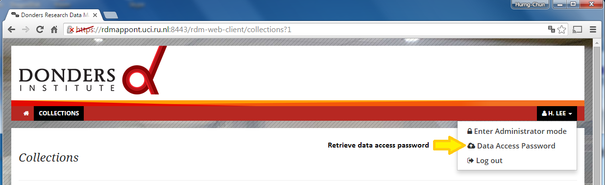

# The RDM data-access account

The data-access account consists of a _username_ and a _password_. This pair of information enables user to access the data content of a RDM collection via a supported data-access interface, such as the [WebDav interface](webdav.md).

For a registered RDM user, the _username_ part of the data-access account is a fixed value.  It is a string combining the user's id and home organisation provided by the identity provider (IdP) through which the user signed in/up to the CMS portal.

The _password_ part is the so-called [One-time password](https://en.wikipedia.org/wiki/HMAC-based_One-time_Password_Algorithm).  It is generated dynamically on the fly, and can only be used once for user authentication in initialising a data-access session.  

## Retrieve the data-access account

After [signing-in/up to the CMS portal](user_signup.md), the data-access account may be retrieved following the instructions below:

1. Click on your display name at the top-right corner of the CMS portal to toggle a pull-down manual, and select the item `Data Access Password`:

  
  
2. Informaton (the _username_ and the _one-time password_) is shown on the overlay page.  You may copy the information and use it in the [data-access client](webdav.md).

  Warning: for security reason, close the overlay page as soon as you have copied the account information.

  
  
3. You can always retrieve a valid account information (with a new _one-time password_ if the previous one has been used) by Step 1.
