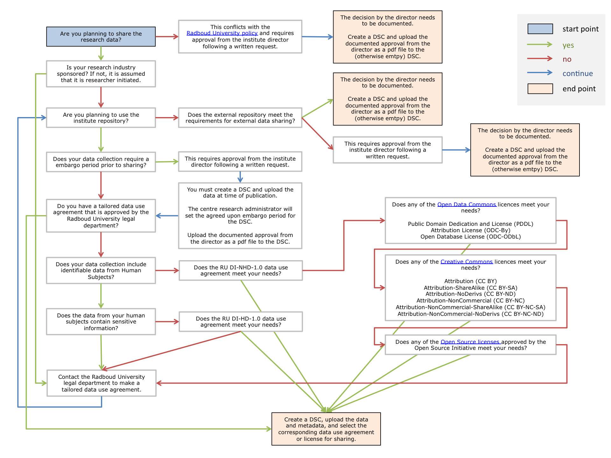

# Data Sharing

## 1. Data use agreements

To share data, analysis pipelines and/or software in a "data sharing collection", the collection manager needs to select a Data Use Agreement and close the collection. Only closed collections can be accessed by external users.

The following data use agreements can apply to collections that include potentially identifiable data from human subjects:

  * [RU-DI-HD-1.0-draft](../agreements/RU-DI-HD-1.0-draft.md)  

The following data use agreements can apply to collections that only include data that cannot be identified in any way (e.g. only group results):

  * [RU-DI-NH-1.0-draft](../agreements/RU-DI-NH-1.0-draft.md)  
  * [CC-BY-4.0](../agreements/CC-BY-4.0.md)
  * [CC-BY-NC-4.0](../agreements/CC-BY-NC-4.0.md)
  * [CC-BY-NC-ND-4.0](../agreements/CC-BY-NC-ND-4.0.md)
  * [CC-BY-NC-SA-4.0](../agreements/CC-BY-NC-SA-4.0.md)
  * [CC-BY-ND-4.0](../agreements/CC-BY-ND-4.0.md)
  * [CC-BY-SA-4.0](../agreements/CC-BY-SA-4.0.md)
  * [ODC-BY-1.0](../agreements/ODC-BY-1.0.md)
  * [ODC-ODbL-1.0](../agreements/ODC-ODbL-1.0.md)
  * [ODC-PDDL-1.0](../agreements/ODC-PDDL-1.0.md)

The following agreements can apply to collections that only include source code of software, simulations or data analysis scripts:

  * [APACHE-2.0](../agreements/APACHE-2.0.md)
  * [ARTISTIC-2.0](../agreements/ARTISTIC-2.0.md)
  * [BSD](../agreements/BSD.md)
  * [EPL-1.0](../agreements/EPL-1.0.md)
  * [GPL-2.0](../agreements/GPL-2.0.md)
  * [GPL-3.0](../agreements/GPL-3.0.md)
  * [LGPL-3.0](../agreements/LGPL-3.0.md)
  * [MIT](../agreements/MIT.md)
  * [MPL-2.0](../agreements/MPL-2.0.md)
  * [ISC](../agreements/ISC.md)

## 2. Decision tree for deciding on a DUA

Please follow the data sharing flowchart to guide your decisions with regards to data sharing.

  

## 3. External links

  * http://www.ru.nl/publish/pages/721701/universitair_beleid_opslag_en_management_onderzoeksdata_cvb_besluit_25-11-2013.pdf
  * http://creativecommons.org
  * http://opendefinition.org
  * http://opendatacommons.org
  * http://opensource.org/licenses
  * http://choosealicense.com
