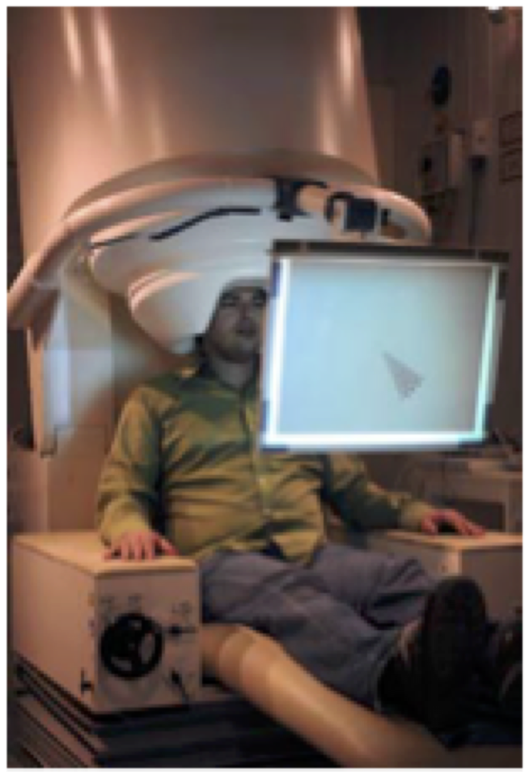

# Template MEG Brochure

## 1. How to use this template brochure?

This is a template brochure to be used by investigators of the Donders Institute. This template is based on brochures that previously have been approved by an accredited medical-ethical Reviewing Committee (the “Commissie Mensgebonden Onderzoek Regio Arnhem-Nijmegen”), it is not an approved brochure. Investigators and their centers should use this template to make a brochure that is to be approved by some ethical reviewing committee. The actual information brochure starts from _2. General_.

This is a template for a MEG information brochure. It is not guaranteed that this template will fit all purposes. It is the responsibility of the investigators and their centers to make it fit. For example, it may be that some content of this template does apply to the investigator’s research, or that some essential information is missing. Also, it may be that the wording used in this template is not appropriate for a particular participant group (e.g., children or patients).

## 2. General

MEG is short for MagnetoEncephaloGraphy. This literally means “magnetic brain writing”.  A MEG system measures the magnetic signals that are induced by brain cells when they are active. Because these signals are very small it is extremely important that disturbing interferences produced by the environment are as small as possible. A MEG measurement is therefore performed in a special shielded room. The MEG system is constructed from a helmet in which sensors are situated which measure the magnetic brain activity. The duration of a MEG measurement depends on the experiment you are participating in. It can range from 30 minutes to about 2 hours. For the subsequent analysis of MEG data it is often useful to have anatomical information about the structures of your brain. In those cases the MEG measurement will be followed by an MRI scan.

## 3. Preparation 

Metal objects can disturb the MEG measurement. Therefore, you will be asked to leave all metal objects outside of the shielded room. When deciding what to wear, keep in mind that the MEG measurement can be disturbed by metal objects for example zippers, metal buttons, hooks and bra’s with metal braces. Jewelry, piercings, hairclips, spectacles etc. with metal parts should also be removed. Because make-up sometimes contains metal particles you are requested not to use make-up before a MEG measurement. Metal correction wires behind the teeth are in principle allowed however should be reported before actual participation.

## 4. The experiment 

For the experiment it is often important not to move your eyes too much. To verify whether you are able to do this sufficiently, some electrodes will be placed around your eyes using stickers.  Afterwards you may enter the shielded room. You will be asked to sit in the chair and put your head inside the helmet. Your eyes, nose, mouth and the lower part of you face will be uncovered. It is very important that you are sitting comfortably and relaxed. For this purpose, we can adjust the backrest and height of the chair. Also pillows are available to make everything more comfortable. Finally, three small electrodes will be placed. Two are attached by the ears, using earplugs. The third is placed on the dimple between your nose and forehead using a sticker. This is done to check for head movements during the experiment. During the measurements the door of the shielded room will be closed, but it will not be locked. The researcher can see you via a video camera and you can communicate via an intercom. Sometimes the experiment will be video and/or -audio recorded for strict scientific purposes. The experimenter will inform you about this in timely fashion prior to the experiment.

## 5. Additional information

The risk associated with participation can be considered as of negligible risk and minimal burden. No invasive procedures are involved.  You can NOT participate in an MEG-experiment if one of the following applies: 

- You have an active implant, such as a pacemaker, insulin pump, neurostimulator or ossicle prosthesis. 
- You suffer from epilepsy. 
- You suffer from claustrophobia. 
- You are pregnant or you think you are. 
- You are younger than 18 years of age when participating 

In some circumstances the research question is leading (in combination with potential use of MRI) whether you can participate. The experimenter will then decide on your participation. This is the case when:

- Metal in the upper body,e.g.: plates, screws, clamps, prosthesis, metal splinters, piercings or medical plasters, or a correcting dental wire. Dental fillings, crowns, tattoos and a contraceptive coils are allowed. 

- If you ever had brain surgery
