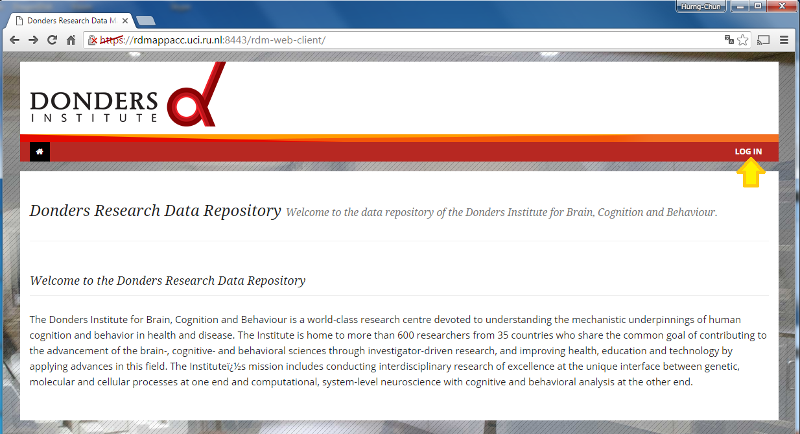
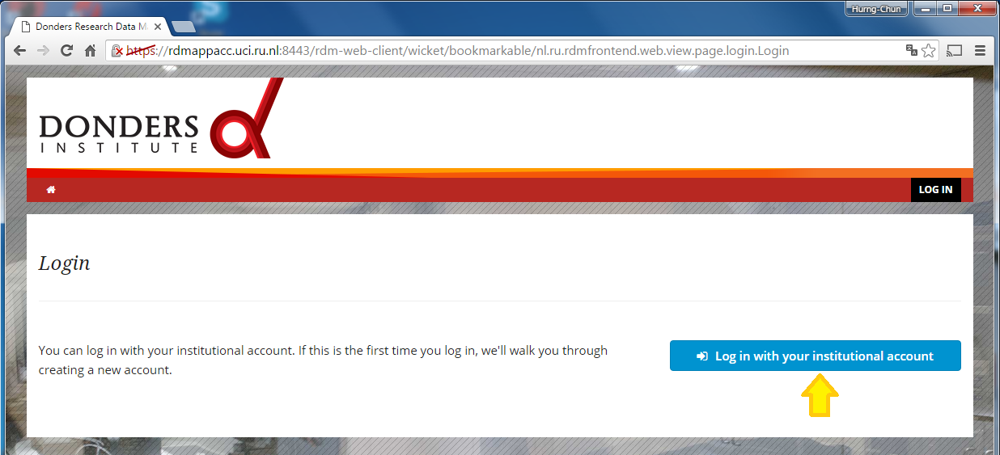
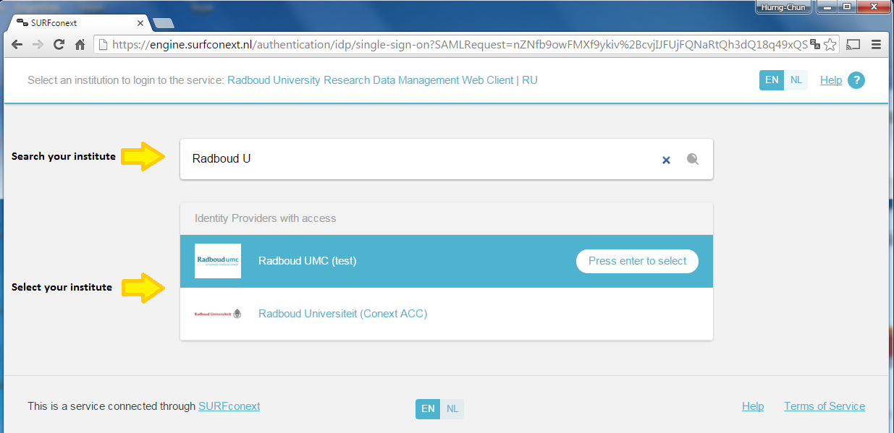
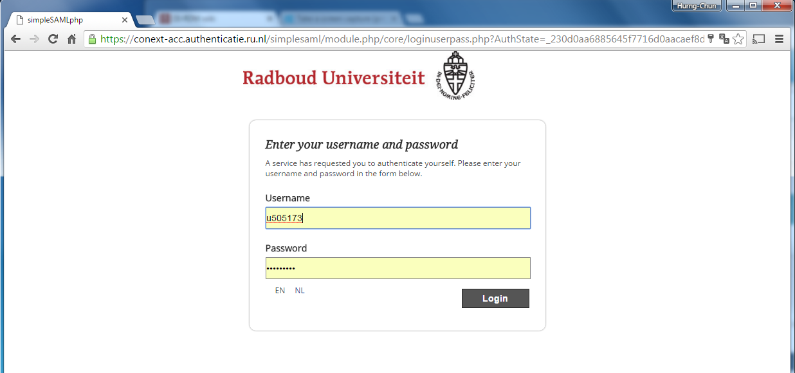

# Sign-in/up to the RDM CMS portal

## Requirement

To sign-in/up the RDM CMS portal, you are required to have a valid account issued by one of the identity providers (IdP's) trusted by SURFConext. Identity providers from almost all university, high-school and research institutions within Netherlands are covered by SURFConext. 

A list of SURFConext trusted IdP's can be found [here](https://www.surf.nl/over-surf/werkmaatschappijen/surfnet/over-surfnet/aansluiten-op-surfnet/aangesloten-instellingen/index.html). 

## Instruction

As long as you have a valid account issued by a SURFConext trusted identity provider (i.e. SURFConext IdP account), you can follow the instructions below to sign-up/in to the RDM CMS portal.

1. Open the URL (https://rdmappacc.uci.ru.nl:8443/rdm-web-client) in your web browser.  You will see the homepage of the web porta.

  

2. At the top-right corner, you will find a `LOG IN` button.  Click it to sign-up/in with your SURFConext IdP account.

  

3. You will be redirected to the SURFConext page on which a list of identity providers are listed.  Use the search field to find your home organisation and click on it for authentication. 

  

4. You will be again redirected to the `login` page of your home organisation.  Fill in your username/password received from your home organisation to login.

  

5. Right after the successful authentication through your home organisation, you are successfully sign-up/in to the RDM CMS portal.  You will be re-directed back to the RDM CMS portal, and to a page on which the RDM collections available for you are listed.

  
