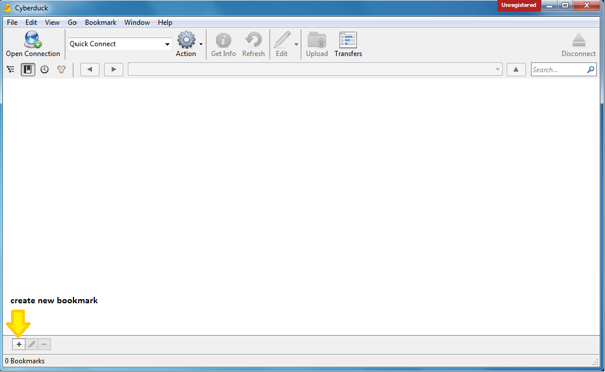
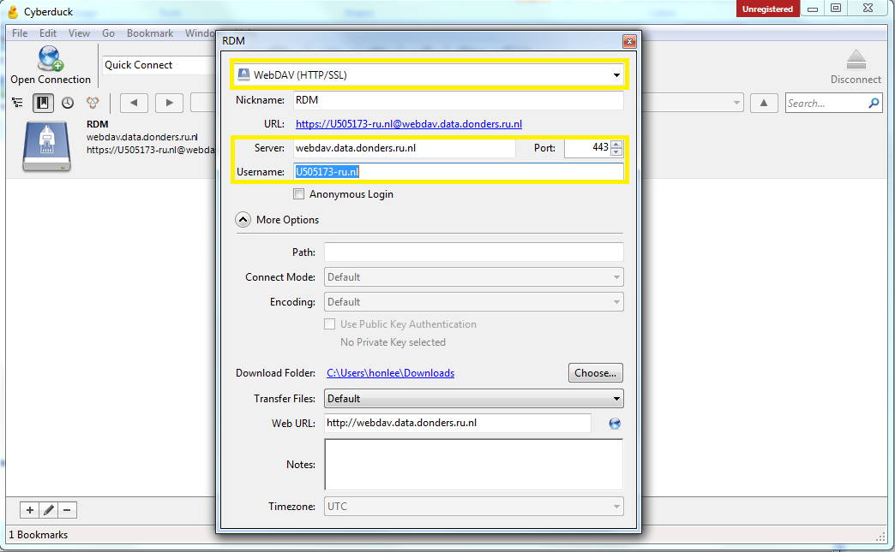
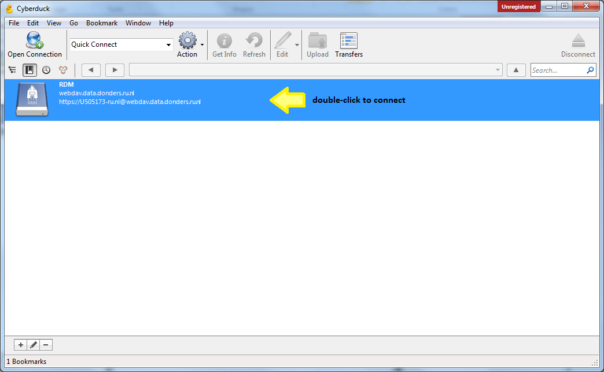
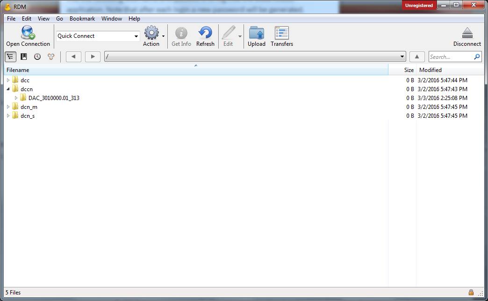

# Accessing collection data using WebDAV client

The data content of a RDM collection consists of files and directories. To access the data content, one uses a HTTP-based file transfer protocol called [WebDAV](https://en.wikipedia.org/wiki/WebDAV).

There are existing client tools for the WebDAV protocol.  However, concerning the best compatibility and cross-platform support, we recommend researchers to use the [CyberDuck](https://cyberduck.io).

Caution: Although the native file browser comes with Windows (i.e. Explorer) and MacOSX (i.e. Finder) works with WebDAV protocol, they are __NOT__ compatible with the RDM WebDAV service.  Please don't use them to access data in the RDM system.

## CyberDuck installation

For Windows and MacOSX systems, the CyberDuck installation is graphical and self-explanatory. Simply download the installer from [the software's website](https://cyberduck.io) and follow instructions step-by-step while executing the installer. You will need the administrator's right to install CyberDuck software on your computer.

For Linux users, CyberDuck is provided as a command-line tools called [duck.sh](https://duck.sh).  The installation instruction can be found [here](https://trac.cyberduck.io/wiki/help/en/howto/cli#Linux).

## CyberDuck setup

Note: This instruction convers only the graphical user interface of CyberDuck. For [duck.sh](https://duck.sh) user, please refer to [this general usage](https://trac.cyberduck.io/wiki/help/en/howto/cli#Usage).

1. Open the CyberDuck application, and create a new connection bookmark:

  

2. Configure the connection with the following parameters:

  * __WebDAV (HTTP/SSL)__
  * Server: __rdmappacc.uci.ru.nl__
  * Port: __8443__
  * Username: __untick the `Anonymous Login` and set it to the _username_ of the [data-access account](data_access_account.md)__
  * Path: __rdm-webdav__
  
  The configurations are saved to the bookmark on-the-fly.  Just close the configuration window when you are done with the configuration.

  

3. Click on the saved bookmark to make connection.  You will be asked for a login password.  Please fill in the _one-time password_ of your [data-access account](data_access_account.md) retrieved from the CMS portal.

  

4. Once you loggin to the WebDAV service, you will see a filesystem-like structure with four directories, each pertains to a centre (or organisational-unit in case of DCN) of the Donders Institute. You may click into a directory and consequently see sub-directories referring to the RDM collections belong to a centre/organisational-unit. Within the directory of a RDM collection, you will see the data content in terms of files and directories.

  

5. As a viewer of the collection, you are only allowed to download data content (files/directories) from a collection.  As a contributor or manager, you are also allowed to upload and modify data via the WebDAV client. 

## Alternative clients

The table below provides a list of tested WebDAV clients that work smoothly with the RDM WebDAV service.  You may use them as alternatives to the CyberDuck.

|   Platform    |     Software                                  |  GUI suppor   |
| ------------- | --------------------------------------------- | ------------- |
|   Liunx       | [Cadaver](http://www.webdav.org/cadaver/)     |      N        |
